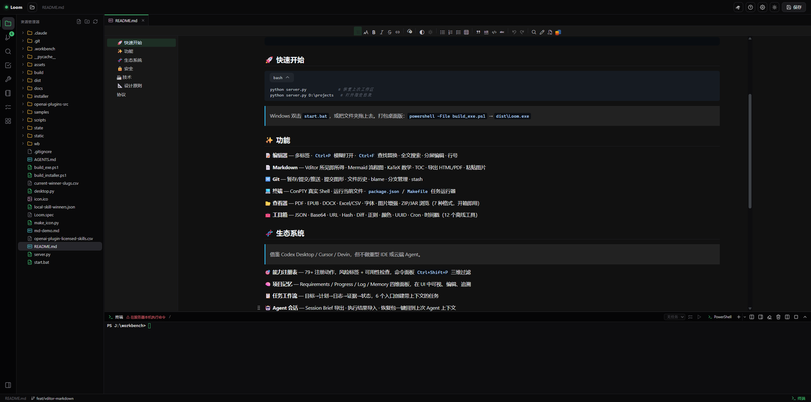

<p align="center">
  
</p>

<h1 align="center">Loom</h1>

<p align="center">
  <b>轻量本地工作台 · 零依赖 · 完全离线</b>
</p>

<p align="center">
  
  
  
  
</p>

<p align="center">
  VS Code 风格布局，Codex / Cursor / Devin 式生态。<br>
  不需要 Node.js，不需要联网，不需要 pip install。<br>
  <b>一个 Python 文件启动，一个 EXE 双击即用。</b>
</p>

<p align="center">
  
</p>

## 🚀 快速开始

```bash
python server.py              # 恢复上次工作区
python server.py D:\projects   # 打开指定目录
```

> Windows 双击 `start.bat`，或把文件夹拖上去。打包桌面版：`powershell -File build_exe.ps1` → `dist\Loom.exe`

## ✨ 功能

**📝 编辑器** — 多标签 · `Ctrl+P` 模糊打开 · `Ctrl+F` 查找替换 · 全文搜索 · 分屏编辑 · 行号

**📄 Markdown** — Vditor 所见即所得 · Mermaid 流程图 · KaTeX 数学 · TOC · 导出 HTML/PDF · 粘贴图片

**🔀 Git** — 暂存/提交/推送 · 提交图形 · 文件历史 · blame · 分支管理 · stash

**💻 终端** — ConPTY 真实 Shell · 运行当前文件 · `package.json` / `Makefile` 任务运行器

**📂 查看器** — PDF · EPUB · DOCX · Excel/CSV · 字体 · 图片增强 · ZIP/JAR 浏览（7 种格式，开箱即用）

**🧰 工具箱** — JSON · Base64 · URL · Hash · Diff · 正则 · 颜色 · UUID · Cron · 时间戳（12 个离线工具）

## 🧬 生态系统

> 借鉴 Codex Desktop / Cursor / Devin，但不做重型 IDE 或云端 Agent。

**🎯 能力注册表** — 79+ 注册动作，风险标签 + 可用性检查，命令面板 `Ctrl+Shift+P` 三维过滤

**🧠 项目记忆** — Requirements / Progress / Log / Memory 四维面板，在 UI 中可视、编辑、追溯

**📋 任务工作流** — 目标→计划→日志→证据→状态，6 个入口创建带上下文的任务

**🤖 Agent 会话** — Session Brief 导出 · 执行结果导入 · 恢复包一键回到上次 Agent 上下文

**📦 Skills / Playbooks** — 本地流程定义，执行预览（查看/复制，不自动执行），推荐下一步

## 🔒 安全

默认 `127.0.0.1` 绑定 · CSRF 四重校验 · CSP 禁内联 · DNS 重绑定防护 · 路径穿越双重阻断 · 搜索超时 · 终端输入上限

## 🏗 技术

```
后端    Python 标准库    零 pip 依赖    3,400 行
前端    原生 JS (IIFE)   零构建步骤    12,800 行 JS + 2,800 行 CSS
桌面    pywebview        可选          ~78MB 独立 EXE
```

## 📐 设计原则

- **本地优先** — 不依赖云服务 · 不需要账号 · 不采集数据
- **零依赖** — 后端纯标准库 · 前端本地 vendor
- **安全默认** — 按钮要么能用要么说明原因 · 脚本不自动执行
- **轻量克制** — 不做扩展市场 · 不做完整 IDE 内核 · 不做云端 Agent

## 协议

Private project.
