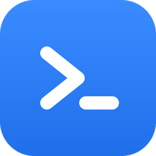

<p align="center">
  
</p>

<h1 align="center">Loom</h1>

<p align="center">
  <b>轻量本地工作台</b><br>
  VS Code 风格布局 · Codex/Cursor 式生态 · 零依赖 · 完全离线
</p>

<p align="center">
  
  
  
  
</p>

---

## 这是什么

Loom 是一个**本地优先的轻量桌面工作台**。它像 VS Code 一样管理文件、编辑代码、操作 Git、运行终端，同时像 Codex Desktop / Cursor 一样把**项目记忆、任务工作流、Agent 会话、技能与流程**串成可追踪的工作闭环。

不需要安装 Node.js，不需要联网，不需要任何 `pip install`。一个 Python 文件启动，一个 EXE 双击即用。

---

## 快速开始

```bash
python server.py                    # 恢复上次工作区
python server.py D:\my-project      # 打开指定目录
```

Windows 用户可直接双击 `start.bat`，或把文件夹**拖到 `start.bat` 上**。

> 打包为独立桌面应用（无需 Python）：`powershell -File build_exe.ps1` → `dist\Loom.exe`

---

## 核心能力

### 编辑器

| 功能 | 说明 |
|------|------|
| 多标签编辑 | 脏标记 · 未保存确认 · 拖拽排序 · 中键关闭 |
| 快速打开 | `Ctrl+P` 模糊匹配，匹配字符高亮 |
| 查找替换 | `Ctrl+F` 字符串 / 正则 · 大小写 · 计数 · 全部替换 |
| 全文搜索 | 跨文件递归 · 正则 · 结果按文件分组 · 点击跳转 |
| 分屏编辑 | 水平 / 垂直分屏 · 独立焦点和状态 |

### Markdown

> Vditor 所见即所得，不是简单的 textarea + 预览。

- 紧凑工具栏 · 嵌入式大纲 · 实时渲染
- **Mermaid** 流程图 · **KaTeX** 数学公式 · **TOC** 导航
- 导出 **HTML** / 打印 **PDF**
- 粘贴图片自动保存到 `assets/` 并插入链接
- 任务清单点击勾选，回写源码 `[ ] ⇄ [x]`

### Git 源代码管理

- 暂存 / 取消暂存 / 提交 (`Ctrl+Enter`) / 推送 / 初始化
- **提交图形**：SVG 多通道节点 + 分支标签 · 点击展开改动文件 · 逐提交 diff
- 文件历史 · blame 逐行着色 · 分支管理 · stash 储藏 / 弹出

### 集成终端

- 底部可折叠面板 · ConPTY / winpty 真实 Shell
- **运行当前文件**（.py / .js / .sh / .ps1）
- **任务运行器**：自动读取 `package.json` scripts 和 `Makefile` 目标

### 文件查看器

开箱支持 **7 种格式**，无需安装额外软件：

| PDF | EPUB | DOCX | Excel/CSV | 字体 | 图片增强 | 压缩包 |
|-----|------|------|-----------|------|----------|--------|
| pdf.js 渲染 | 翻页 + 目录 | 文档预览 | 多 Sheet 切换 | 字形预览 · 试字 | HEIC/PSD/TIFF | ZIP/JAR 浏览 |

### 工具箱

12 个纯前端工具，离线可用：

`JSON` · `Base64` · `URL 编解码` · `时间戳转换` · `Hash (SHA-*)` · `字数统计` · `文本对比` · `正则测试` · `颜色转换` · `UUID` · `Cron 解析` · `Markdown 表格`

---

## 生态系统

> 借鉴 Codex Desktop / Cursor / Devin，但不做重型 IDE 或云端 Agent。

### 能力注册表

79+ 个注册能力，每个都有**风险标签**（只读 / 写入 / 执行 / 网络）和**可用性检查**。命令面板 `Ctrl+Shift+P` 按风险、类型、来源三维过滤，不可用时显示原因而非静默失败。

### 项目记忆

把 `state/` 目录从纯文件升级为**可视面板**：

- **Requirements** — 当前目标与约束
- **Progress** — 进行中 / 下一步 / 已验证
- **Log** — 时间线决策记录
- **Memory** — 稳定架构事实

可在 UI 中查看、编辑、追加验证记录和决策记录。恢复中心一键回到上次工作上下文。

### 任务工作流

不只是 Todo，是**可追踪的工作对象**：

```
目标 → 计划 → 执行日志 → 验证证据 → 状态 → 下一步
```

从当前文件、Git 变更、Markdown、终端、Playbook、工作区布局——**6 个入口**创建带来源上下文的任务。

### Agent 会话

- 从任务导出完整 **Session Brief**（目标 + 约束 + 相关文件 + 验证命令 + Git 状态）
- 把外部 Agent / CLI 的执行结果**导入**任务日志和项目记忆
- **恢复包**：重新打开工作区后，从 Session 恢复上次 Agent 工作上下文

### Skills / Playbooks

`.workbench/` 目录下的本地流程定义：

- 扫描并展示 Skill / Playbook 元信息、风险、输入、验证项
- **执行预览**：展示命令、作用范围、证据字段（但不自动执行）
- 创建任务 · 复制验证命令 · 推荐下一步卡片

> 安全边界：当前只支持查看和复制，不会直接执行脚本。

---

## 安全

| 层 | 机制 |
|----|------|
| 文件隔离 | 所有 I/O 限制在工作区内，`../` 穿越被 resolve + realpath 双重阻断 |
| CSRF | Content-Type + Origin + Host + Sec-Fetch-Site 四重校验 |
| 绑定 | 默认 `127.0.0.1`，非本地需显式 `WORKBENCH_ALLOW_REMOTE=1` |
| CSP | 禁止内联脚本 · `object-src 'none'` |
| DNS 重绑定 | 严格 loopback Host 白名单 |
| 搜索保护 | 10 秒超时 · 单文件 2MB 上限 |
| 终端保护 | 输入 1MB 上限 · 最多 8 个会话 |

---

## 技术栈

```
后端    Python 标准库 (http.server)     零 pip 依赖
前端    原生 JavaScript (IIFE 模块)     零构建步骤
桌面    pywebview 原生窗口              可选
打包    PyInstaller + Inno Setup        ~78MB 独立 EXE
```

| 指标 | 数值 |
|------|------|
| 自研代码 | ~22,000 行 |
| 后端 | 3,400 行 Python |
| 前端 | 12,800 行 JS + 2,800 行 CSS |
| 文件查看器 | 2,200 行（7 个模块） |
| 注册能力 | 79+ |
| ActionState API | 16 个 |
| 无障碍 | 67 个 aria-label |

---

## 设计原则

- **本地优先** — 不依赖云服务、不需要账号、不采集数据
- **零依赖** — 后端纯标准库，前端本地 vendor
- **离线可用** — 所有功能不需要网络
- **安全默认** — 按钮要么能用要么说明原因，脚本不自动执行
- **轻量克制** — 不做 VS Code 扩展市场，不做完整 IDE 内核，不做云端 Agent

---

## 协议

Private project.
